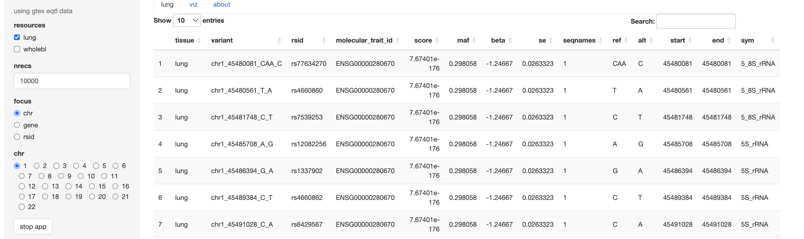

# GGIpack2

Generic genome interrogation, starting with eQTL data wrangling.

## GTEx application

```
BiocManager::install(c("vjcitn/GGIpack2", "BiocFileCache"))
library(GGIpack2)
example(gtexapp, ask=FALSE)
```

The basic interface will appear, as


