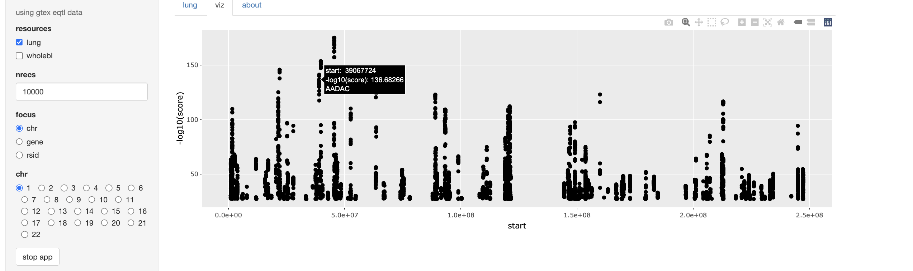

# GGIpack2

Generic genome interrogation, starting with eQTL data wrangling.

## GTEx application

```
BiocManager::install(c("vjcitn/GGIpack2", "BiocFileCache"))
library(GGIpack2)
example(gtexapp, ask=FALSE)
```

The basic interface will appear with default focus 'chromosome', as


The 'viz' tab will show a plotly display with every locus
on the selected chromosome.



When focus is changed to gene or SNP, a more limited tabulation
will be presented.  Filtering processes may need additional work,
file issues at github.com/vjcitn/GGIpack2.
